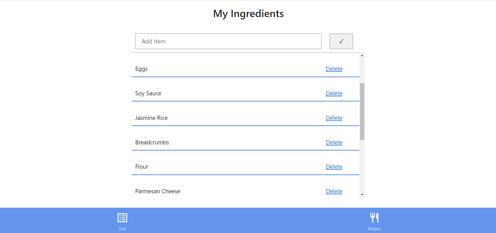
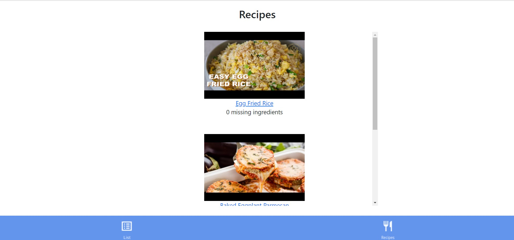
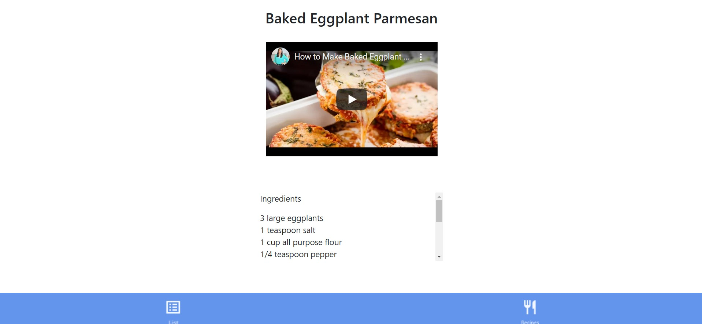
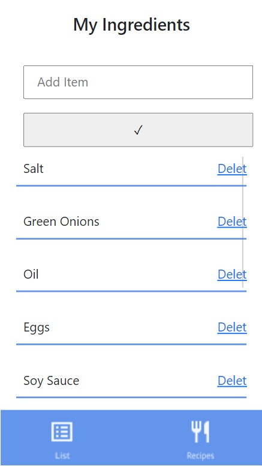
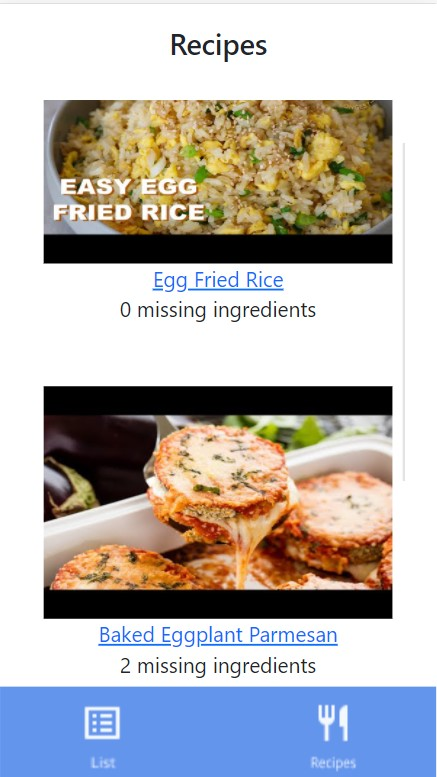
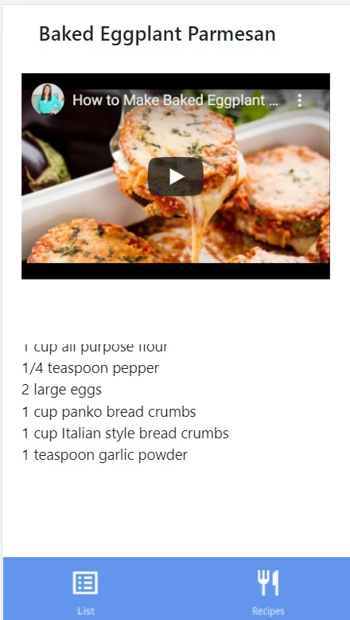

# Cookify-nwHacks2021
Cookify is a responsive web application, combining a grocery list app and a cooking app, that logically generates the top 3 dishes matching ingredients in a users' grocery list. It means to help a user have an easier time to create a grocery list and learn how to cook various dishes from the ingredients that they already have.

The fact that many people start learning to cook food by themself instead of dining out during the COVID-19 pandemic inspires me to come up with an idea for this project.

**Check out this link**: [https://cookify-nwhack-2021.herokuapp.com/] (https://cookify-nwhack-2021.herokuapp.com/) 

## How does Cookify works?
1. Ask a user to create a grocery list 
2. Allow a user to add or delete items in the list
3. Take ingredients in the list to generate the top 3 dishes that match the available ingredients in the list
4. Allow a user to choose to explore each of those top 3 dishes
5. Provide the amount of needed ingredient to cook those dishes
6. Provide cooking videos that teach users step-by-step on how to cook those dishes

## Key Skills
* Python
* Flask
* Sqlite
* Jinja 2
* HTML/CSS/Bootstrap

## Future improvements
This web application is a demo that was built within a limited 24 hours of the hackathon condition. Many functions can be added
1. Add more list of dishes to the app
2. Improve the matching learning part of the app (eg. ask a user to make a "food preference profile" that will be considered when generating the top 3 dishes for users)
3. Make a login system that will allow this app available and unique for each user (the current demo version is that all user share the same account and therefore the same list)

## Example of The app on PC and Smartphone

### Grocery List page on PC
    

### Top 3 Dishes Page on PC
 

### Cooking Instruction Page on PC
 

### Grocery List page on Smartphone

### Top 3 Dishes Page on Smartphone
  

### Cooking Instruction Page on Smartphone

